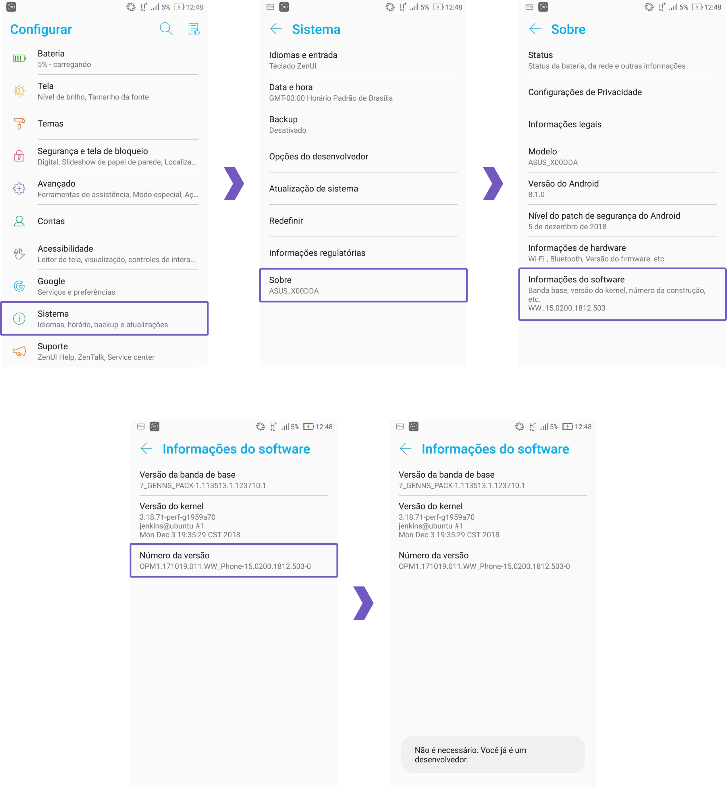
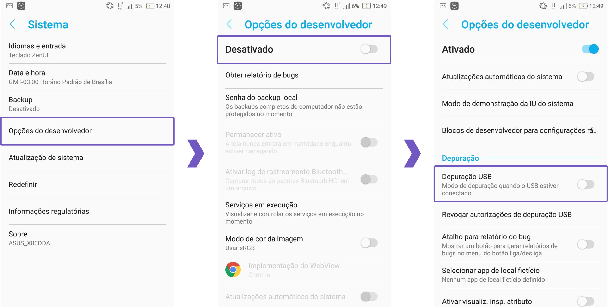
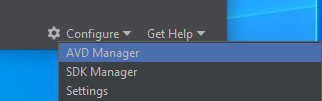
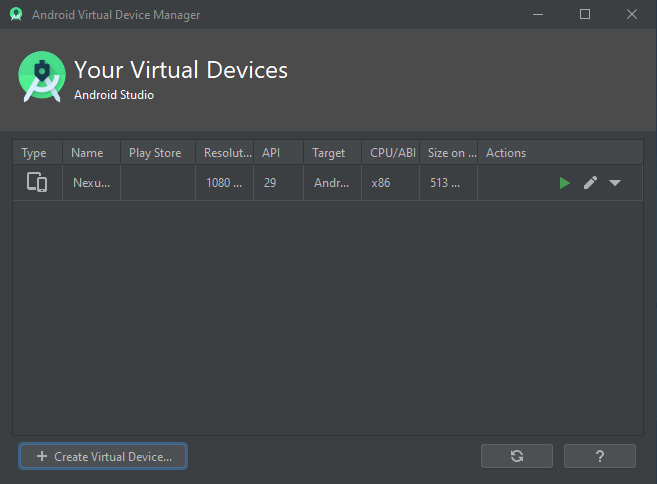
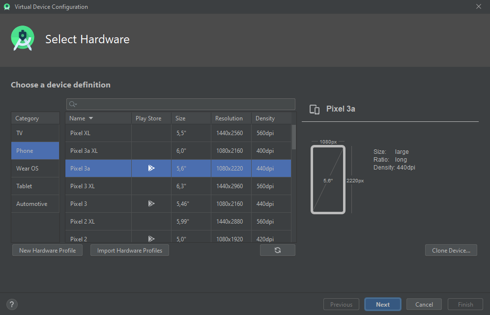
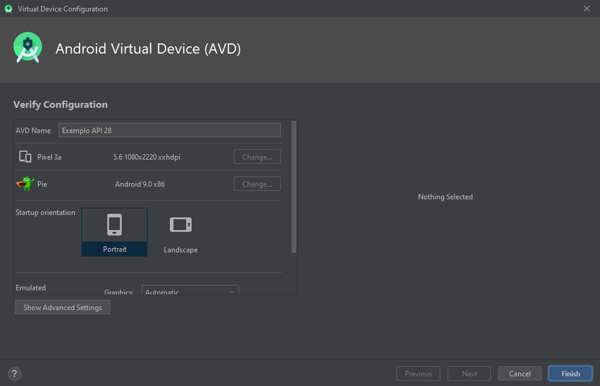
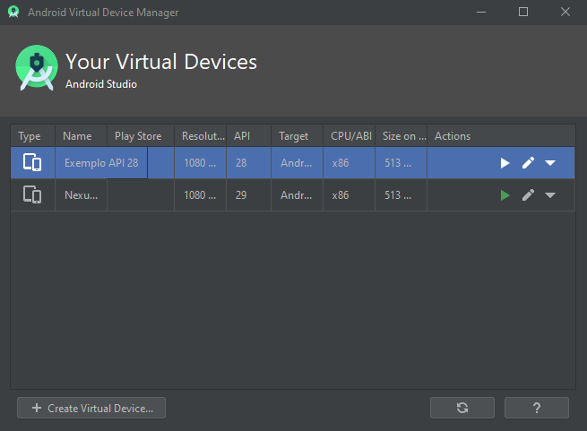
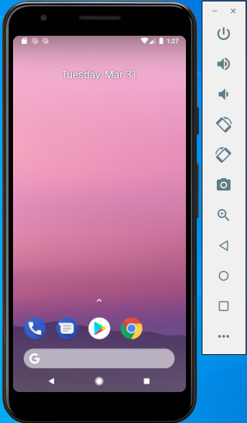
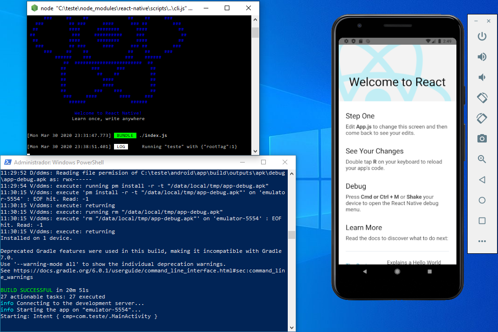

# Introdução

Nesse guia iremos mostrar o passo a passo para preparar o seu Ambiente React Native em sistemas Windows. Você irá aprender também como executar suas aplicações React Native em emuladores Android e em dispositivos físicos Android (via USB).

## Testar o app sem instalação de ambiente

Para testar o aplicativo diretamente em seu smartphone android, bastar baixa-lo através [deste link](https://github.com/LGomees/PI2-Carroca-Eletrica/raw/main/app-release.apk) e instalá-lo em seu dispositivo.

### Dependencias

Para configurar o ambiente no Wndows, iremos realizar 5 instalações principais:

- Chocolatey;
- Node.js 14 (LTS)
- Yarn
- Open JDK 8 (LTS)
- Android Studio

### Instalando cholocatey

Para instalar as libs no Windows, vamos utilizar um gerenciador de pacotes do Windows chamado Chocolatey. Esse gerenciador nos possibilita instalar dependências e ferramentas no sistema com poucos comandos e tudo pelo terminal. Execute o powershell como administrador executando o comando:

```Powershell
Windows + X
```

ou clicando com o botão direito sobre o botão “Iniciar”:


Execute o comando abaixo para verificar se você possui permissões para instalar dependências com o terminal:

```Powershell
Get-ExecutionPolicy
```

Caso o retorno desse comando seja diferente de “Restricted”, pule para o próximo passo. Porém, se o retorno for “Restricted”, execute o seguinte comando em seu terminal:

```Powershell
Set-ExecutionPolicy AllSigned
```

Agora, execute o seguinte comando para instalar o `Chocolatey`:

```Powershell
Set-ExecutionPolicy Bypass -Scope Process -Force; [System.Net.ServicePointManager]::SecurityProtocol = [System.Net.ServicePointManager]::SecurityProtocol -bor 3072; iex ((New-Object System.Net.WebClient).DownloadString('https://chocolatey.org/install.ps1'))
```

Agora, reinicie seu Powershell.

### Instalação Node.js (LTS)

Execute o comando para instalar o Node:

```Powershell
choco install -y nodejs --version=14.18.1
```

### Instalação OpenJDK8 (LTS)

Execute o comando para instalar o Java:

```Powershell
choco install -y openjdk8
```

Agora reinicie o Powershell e execute, um de cada vez, os seguintes comandos para verificar se instalou corretamente:

```Powershell
node -v
npm -v
java -version
```

Se todas apresentaram os valores das suas versões, a instalação foi um sucesso.

### Instalando Yarn

Execute o comando para instalar o Yarn:

```Powershell
npm install --global yarn
```

Para que as instalações globais do Yarn funcionem, vamos ter que fazer mais um passo. Execute o comando:

```Powershell
yarn global bin
```

Após a instalação, verifique se ela foi realizada com sucesso com o comando:

```Powershell
yarn -v
```

### Instalando Android Studio

Faça [download e instale o Android Studio](https://developer.android.com/studio/index.html)

##### Rodar aplicativo em um smarphone android via USB

**Opções de Desenvolvedor**

Primeiramente conecte seu dispositivo via USB.

Com o dispositivo conectado é necessário que ele esteja com a Depuração USB habilitada, caso o seu ainda não esteja com as Opções de Desenvolvedor habilitadas, você pode seguir os passos abaixo.

> Os passos para ativar as Opções de Desenvolvedor podem variar muito dependendo do aparelho e da versão do Android. Caso não consiga ativar por esse tutorial, pesquise como ativar para o seu aparelho

Abra as Configurações do seu dispositivo, dentro das configurações vá no Menu Sistema, dentro de Sistema procure e abra a opção Sobre, o último Menu onde você deve entrar é Informações de Software.

Na tela que foi aberta clique repetidamente sobre o Número da Versão até aparecer uma mensagem indicando que as opções de desenvolvedor foram ativadas.

Você pode ver o passo a passo nas imagens abaixo:



Feito isso falta apenas ativar a Depuração USB para o dispositivo estar pronto para uso, você deve voltar até o Menu Sistema e procurar pela opção Opções de desenvolvedor, que agora deve aparecer na sua lista.

Ao entrar nesse Menu você deve ativá-lo selecionando o primeiro botão que deve estar como Desativado e por último você tem que ativar a Depuração USB, que está um pouco abaixo nessa lista.

Você pode ver o passo a passo nas imagens abaixo:



#### (Opicional) Rodar aplicativo em um emulador android

> Caso você possua um dispositivo físico Android e seu computador tenha configurações modestas (ex.: ⬇ i3, ⬇ 4gb RAM), é recomendado executar a aplicação diretamente no dispositivo físico via USB.

##### AVD Manager

Utilizaremos o emulador do Android Studio pois com as atualizações recentes se consolidou como a melhor opção atualmente.

Abra o Android Studio. No canto inferior direito da janela, clique em Configure e escolha a opção AVD Manager.



Na sequência, será apresentada uma tela com os emuladores instalados. Se você marcou a opção Android Virtual Device na etapa de configuração do Android Studio, deve aparecer um emulador já configurado e pronto para uso. Caso queira utilizar esse mesmo, pule para a próxima seção. Porém, caso queira criar seu próprio emulador, selecione a opção Create Virtual Device no canto inferior esquerdo.



Nessa etapa, será perguntado qual Hardware você quer selecionar. Como exemplo, escolhi na aba Phone o Pixel 3a (perceba que ele e apenas alguns outros tem acesso a Play Store, caso esse seja um fator importante na sua decisão). Após escolher, clique em Next.



Em seguida, você deverá escolher a imagem do sistema (API) do emulador a partir de uma das três listas: Recommended, x86 Images e Other Images. Se essa é sua primeira vez, provavelmente nenhuma imagem estará baixada. Clique no link de Download na frente do nome da imagem, aceite as licenças e aguarde a instalação. Como exemplo, escolhi da lista Recommended a opção Pie (API 28) que é compatível com o Google Play.

Por fim, serão apresentada algumas configurações do seu emulador (Android Virtual Device - AVD). No campo AVD Name escolha um nome para o seu emulador e clique em Finish.



Agora, o seu emulador deve estar aparecendo na lista.



##### Iniciando o Emulador

Com o emulador pronto, basta clicar no botão Play e aguardar o AVD iniciar. Esse processo pode demorar, principalmente na primeira execução. Quando ele terminar, deve aparecer um resultado parecido com esse



## Executando o app

> Método válido tanto para Emulador quando para o Dispositivo USB

Agora, com o emulador aberto, basta abrir dois Powershell. Um para executar o Metro Bundler e o segundo para instalar o app. Os comandos são:

- Powershell 1

```Powershell
yarn start
```

- Powershell 2

```Powershell
yarn run android
```


